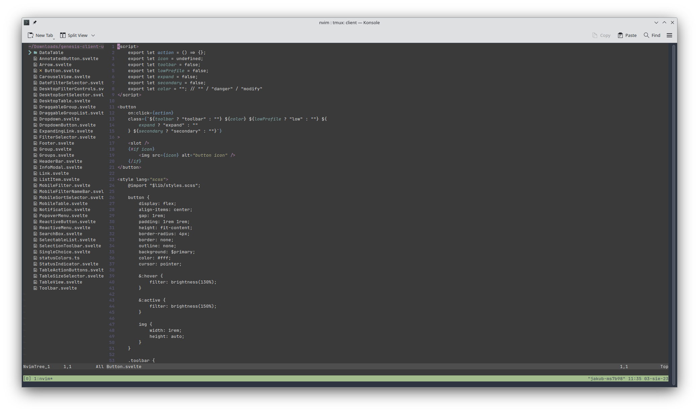

# dotfiles
Dotfiles for my unix configurations.

### My current configuration
##### Zsh themes and add-ons
* [Oh My Zsh](https://github.com/ohmyzsh/ohmyzsh)
* [Spaceship prompt](https://github.com/denysdovhan/spaceship-prompt)
* [zsh-syntax-highlighting](https://github.com/zsh-users/zsh-syntax-highlighting)
* [zsh-autosuggestions](https://github.com/zsh-users/zsh-autosuggestions)

##### Font
* [JetBrains Mono](https://github.com/tonsky/FiraCode) - terminal
* [Montserrat](https://fonts.google.com/specimen/Montserrat) - UI

##### Color scheme
* [Nord](https://www.nordtheme.com/)

### Installation
To install just run `./install.sh` in your zsh prompt.
